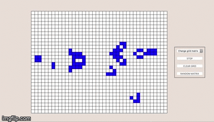

# Conway's game of life

Conway's game of life built using Redux + Hooks

## Getting Started

```
yarn
```

```
yarn start
```

## Demo



## TODO

- some more styling
- dropdown to select generation speed
- maybe do something intresting with ML? (because why not)
- some info on cell generation, etc..
- Host on github pages
